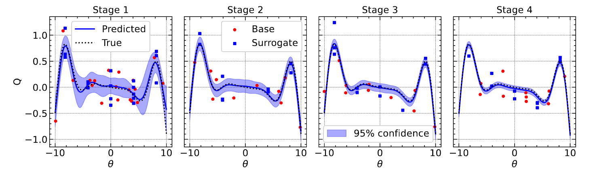

Simulations
=====
A complete description of CAMELS-zoomGZ and its creation can be found in M. E. Lee, S. Genel, B. Wandelt, et al. 2024: https://arxiv.org/abs/....

.. _overview:
Overview of CAMELS-zoomGZ
------------
CAMELS-zoomGZ is a suite of 768 zoom-in simulations of halos between the mass range of :math:`M^{13}M_\odot\,h^{-1}-M^{14.5}M_\odot\,h^{-1}`, and spanning 28 astrophysical and cosmological parameters in the IllustrisTNG galaxy formation model. The parameter space ranges spanned in CAMELS-zoomGZ match those of CAMELS IllustrisTNG-SB28 (see https://arxiv.org/abs/2304.02096 or https://camels.readthedocs.io/en/latest/description.html)

.. _generation:
Simulation generation
------------
At each parameter space location, we run three separate simulations: A parent simulation used to identify a halo for zooming in, a hydrodynamical zoom-in, and a dark matter-only analog zoom-in. We first create a :math:`(200 {\rm Mpc}\,h^{-1})^3` parent box with :math:`256^3` dark matter particles that have mass :math:`M_{dm} = 1.323\times 10^{11}\Omega_m \,M_\odot\,h^{-1}` where :math:`\Omega_m` is the matter density of the universe and is varied in the 28-dimensional parameter space. Initial fluctuations are generated at z=127 using MUltiScaleInitialConditions (`MUSIC <https://www-n.oca.eu/ohahn/MUSIC/>`_)  with second-order Lagrangian Perturbation Theory and evolved to z=0 using `AREPO <https://arepo-code.org/wp-content/userguide/index.html>`_. We identify halos in the parent box using the Friends of Friends algorithm. We then look for a halo at z=0 with mass M_{200} (which is calculated by SUBFIND around the particle with the minimum energy and with respect to the critical density) closest to the desired mass.

All particles within :math:`6\times R_{200}` of the chosen halo are identified and traced back to their locations in the initial conditions, where a bounding rectangular Lagrangian region is drawn to encapsulate all of the traced particles. The hydrodynamical zoom-in simulation is then run centered on the chosen halo, where the gas particles have :math:`M_{\rm gas} = 1.26\times 10^{7}\left(\Omega_b/0.049\right) \,h^{-1} M_\odot` and the high-resolution Lagrangian region contains dark matter particles with mass :math:`M_{\rm DM, High Res} = 6.49\times 10^{7}\left((\Omega_m - \Omega_b)/0.251\right) \,h^{-1} M_\odot`, matching the resolution of the flagship CAMELS boxes. For completeness, we perform associated dark matter-only zoom-in analogs to match the above using the same method and with the same resolution. 

For each simulation, we output 91 snapshots between z=127 and z=0. You can find the full list of redshifts and scale factors `here <https://github.com/franciscovillaescusa/CAMELS/edit/master/docs/source/description.rst>`_.

.. Warning::

   We keep snapshots at redshifts=2, 1, 0.5, 0.25, and 0 publicly available but have moved the rest to tape storage. If you need these, please `reach out <camel.simulations@gmail.com>`_.

.. _sampling:
Parameter space sampling
------------
We follow the novel parameter space sampling scheme, `CARPoolGP <https://github.com/Maxelee/CARPoolGP>`_, which allows for reduced variance emulation of quantities given a sparse sampling of data in a high dimensional parameter space. CARPoolGP requires two types of samples: *Base* samples, which are broadly distributed throughout the parameter space, and *Surrogate* samples, which occupy predefined locations in parameter space (which we call parameter islands) but which are correlated to a base sample. Then, in the context of CAMELS-zoomGZ - every base simulation of a halo at some parameter space location contains a surrogate simulation of the **exact same halo** but located at a different point in parameter space. This implies there are 384 unique halos simulated in this suite, each containing a partner simulation. In CAMELS-zoomGZ, we use 128 parameter islands drawn from a sobol sequence over the 29-dimensional parameter space (28 astrophysical parameters + 1 mass parameter). 

.. _AL:
Active learning sampling
------------
CARPoolGP allows for an active learning parameter space sampling strategy, which seeks to sample parameter space at the locations that provide the most significant predictive variance reduction (see figure below for a 1D toy example). This process occurs in stages, where first, a quantity is emulated, and the predictive error is evaluated, then a set of points throughout the parameter space are tested to see which points provide the most significant variance reduction. These parameter space locations and associated surrogate locations are then used to perform the next stage of samples.

In CAMELS-zoomGZ, we adopt this approach, minimizing the variance on the integrated Compton Y parameter. We perform four stages of simulations, which can be found in the following directories:

+-----------------------+---------------+-----------------+------------------------+-----------------------+
|Stage                  |Number of base |base dir numbers |Number of surrogate     | surrogate dir numbers |
+=======================+===============+=================+========================+=======================+
|1                      |128            |zoom0-zoom128    |128                     |zoom128-zoom256        |
+-----------------------+---------------+-----------------+------------------------+-----------------------+
|2                      |128            |zoom256-zoom384  |128                     |zoom384-zoom512        |
+-----------------------+---------------+-----------------+------------------------+-----------------------+
|3                      |64             |zoom512-zoom576  |64                      |zoom576-zoom640        |
+-----------------------+---------------+-----------------+------------------------+-----------------------+
|4                      |64             |zoom640-zoom704  |64                      |zoom704-zoom768        |
+-----------------------+---------------+-----------------+------------------------+-----------------------+

.. .. _characteristics:
.. Simulation characteristics
.. ----------------

